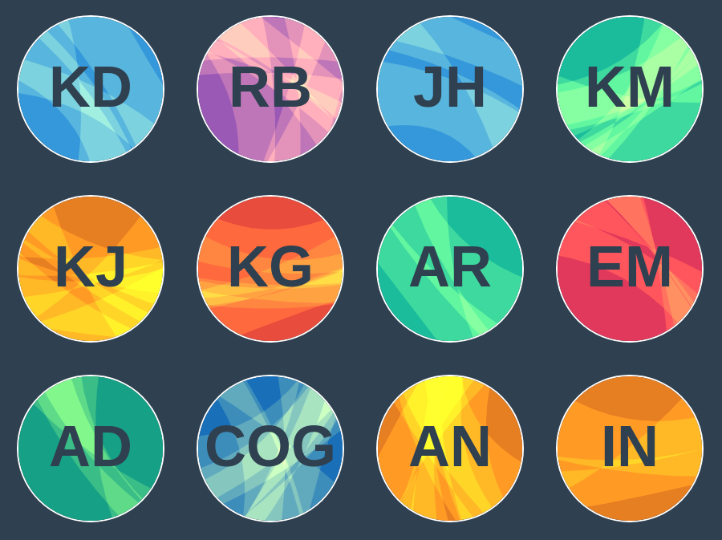

# Marble Identicons

Generate random marble-style identicons.



## Installation

```
npm install @basementuniverse/marble-identicons
```

## Usage

API:
```js
function identicon(
  name: string,
  settings: Partial<IdenticonSettings>
) => HTMLCanvasElement
```

See [below](#settings) for more information on configuration settings.

### In a browser environment

Include the script in your page and call the `identicon` function. It will return a
`HTMLCanvasElement` node which can be appended to the DOM or drawn into another canvas.

Example:
```html
<script src="build/identicon.js"></script>
<script>

const myIdenticon = identicon('Alan Turing');

document.body.appendChild(myIdenticon);

</script>
```

### In React

This example shows one way of wrapping the `HTMLCanvasElement` inside a JSX element:
```tsx
import { useRef, useLayoutEffect } from 'react';
import { identicon } from '@basementuniverse/marble-identicons';

export function MarbleIdenticon({ name }: { name: string }) {
  const ref = useRef<HTMLDivElement>(null);

  useLayoutEffect(() => {
    if (ref.current) {
      ref.current.innerHTML = '';
      ref.current.appendChild(identicon(name));
    }
  });

  return (
    <div className="identicon" ref={ref}></div>
  );
}
```

This component can then be used like so:
```tsx
ReactDOM.render(
  <MarbleIdenticon name="Alan Turing" />,
  document.getElementById('root')
);
```

## Settings

```ts
type IdenticonSettings = {
  size: number;
  baseSeed: string;
  font: string;
  fontStyle: FontStyle;
  fontSize: number;
  backgroundColours: string[];
  initialsColours: string[];
  initialsOffset: vec;
  initialsAlpha: number;
  initialsCompositeOperation: CompositeOperation;
  stripeColours: string[];
  stripeAlpha: number;
  stripeCompositeOperation: CompositeOperation;
  stripes: [number, number];
  stripeWidth: [number, number];
  stripeDeviation: [number, number];
  curveAmount: [number, number];
  curveOffset: [number, number];
  startWidthSign: WidthSign[];
  endWidthSign: WidthSign[];
};
```

| Setting                      | Type                 | Description                                                                                                                                                                                                                        | Default value                                                                                         |
|------------------------------|----------------------|------------------------------------------------------------------------------------------------------------------------------------------------------------------------------------------------------------------------------------|-------------------------------------------------------------------------------------------------------|
| `size`                       | `number`             | The size of the identicon in pixels                                                                                                                                                                                                | `100`                                                                                                 |
| `baseSeed`                   | `string`             | A string that will be prefixed onto the name when seeding the RNG                                                                                                                                                                  | `''`                                                                                                  |
| `font`                       | `string`             | The font family used for the initials                                                                                                                                                                                              | `'Helvetica'`                                                                                         |
| `fontStyle`                  | `FontStyle`          | The font style used for the initials. Must be one of `''`, `'normal'`, `'bold'`, `'italic'`                                                                                                                                        | `'bold'`                                                                                              |
| `fontSize`                   | `number`             | The font size used for the initials, as a factor of `size`                                                                                                                                                                         | `0.4`                                                                                                 |
| `backgroundColours`          | `string[]`           | An array of background colours. One will be picked at random from this list.                                                                                                                                                       | `['#16a085', '#1abc9c', '#2ecc71', '#3498db', '#1970b9', '#9b59b6', '#e67e22', '#e74c3c', '#e0395b']` |
| `initialsColours`            | `string[]`           | An array of colours used for the initials. The index of the randomly-chosen background colour will be used to select from this list, clamped to the size of the array.                                                             | `['#ffffff']`                                                                                         |
| `initialsOffset`             | `vec`                | The initials offset position. `{ x: number, y: number }`                                                                                                                                                                           | `{ x: 0, y: 0 }`                                                                                      |
| `initialsAlpha`              | `number`             | The alpha opacity of the initials                                                                                                                                                                                                  | `1`                                                                                                   |
| `initialsCompositeOperation` | `CompositeOperation` | The global composite operation used for the initials. Must be one of `'source-over'`, `'lighter'`, `'multiply'`, `'screen'`, `'overlay'`, `'color-dodge'`, `'color-burn'`, `'hard-light'`, `'soft-light'`                          | `'source-over'`                                                                                       |
| `stripeColours`              | `string[]`           | An array of colours used for the stripes. The index of the randomly-chosen background colour will be used to select from this list, clamped to the size of the array.                                                              | `['#f1c40f']`                                                                                         |
| `stripeAlpha`                | `number`             | The alpha opacity of the stripes                                                                                                                                                                                                   | `0.15`                                                                                                |
| `stripeCompositeOperation`   | `CompositeOperation` | The global composite operation used for the stripes. Must be one of `'source-over'`, `'lighter'`, `'multiply'`, `'screen'`, `'overlay'`, `'color-dodge'`, `'color-burn'`, `'hard-light'`, `'soft-light'`                           | `'lighter'`                                                                                           |
| `stripes`                    | `[number, number]`   | A tuple containing the minimum and maximum number of stripes to draw                                                                                                                                                               | `[3, 8]`                                                                                              |
| `stripeWidth`                | `[number, number]`   | A tuple containing the minimum and maximum stripe width, measured in radians.                                                                                                                                                      | `[0.2, 0.7]`                                                                                          |
| `stripeDeviation`            | `[number, number]`   | A tuple containing minimum and maximum distances between successive stripes, measured in radians.                                                                                                                                  | `[-0.5, 0.5]`                                                                                         |
| `curveAmount`                | `[number, number]`   | A tuple containing the minimum and maximum radius multiplier for the control point circle.                                                                                                                                         | `[0.2, 0.4]`                                                                                          |
| `curveOffset`                | `[number, number]`   | A tuple containing the minimum and maximum offset angle for the control point measured in radians.                                                                                                                                 | `[0, 0.5]`                                                                                            |
| `startWidthSign`             | `WidthSign[]`        | An array of signs (`'positive'` or `'negative'`) for the starting edge of each stripe. If `startWidthSign` is `['positive']` and `endWidthSign` is `['negative']` (or vice-versa) then the stripe side edges will not cross over.  | `['positive', 'negative']`                                                                            |
| `endWidthSign`               | `WidthSign[]`        | An array of signs (`'positive'` or `'negative'`) for the ending edge of each stripe.                                                                                                                                               | `['positive', 'negative']`                                                                            |
